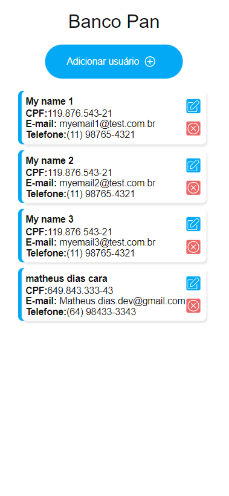

<p align="center">
  
</p>

<br>

## Inicializar Projeto Através do NPM


Nosso primeiro passo é clonar o projeto e entrar na pasta do projeto;

```bash
$ git clone https://github.com/Brunoocn/frontend-bancopan.git
$ cd frontend-bancopan-matheusdias
```

O proximo passo é iniciar o projeto;

```bash
npm install
npm start
```

## Vamos Testar nossa aplicação com o Jest

Para inicializar os testes:

```bash
npm install
npm start
```

## Tecnologias: 

O desenvolvimento se consiste em tais bibliotecas:

- [React](https://reactjs.org)
- [TypeScript](https://www.typescriptlang.org/)
- [Redux toolkit](https://redux-toolkit.js.org/)
- [Redux](https://redux.js.org/)
- [react-router-dom](https://www.npmjs.com/package/react-router-dom)
- [jest](https://jestjs.io/pt-BR/)
