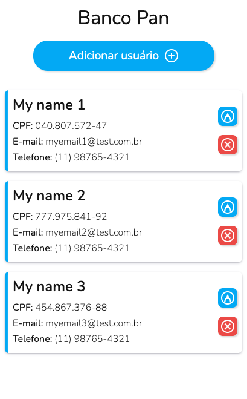
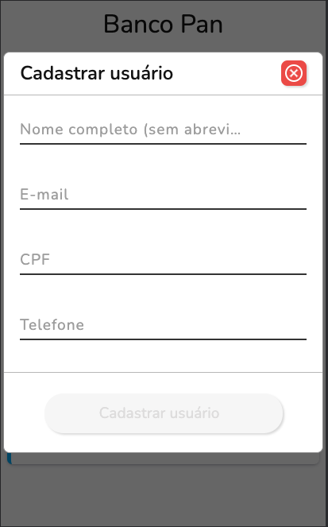

# Front-end

Bem-vindo(a) ao nosso teste para desenvolvedor(a) front-end.

## Sobre o teste

Nosso teste consiste em codificar uma interface baseado nas imagens a baixo:

#### Home

#### Cadastro

## Requisitos

### Requisitos obrigatórios

- Documentação
  - Instruções de instalação, inicialização e testes
  - Descrição sobre as tecnologias utilizadas no projeto
- Design responsivo
- Use endpoint a seguir para pegar os dados iniciais dos usuários.
  - GET: https://private-56d1e-charlesaraujodasilva.apiary-mock.com/users
- Utilize os cookies ou localstorage como banco de dados.
- Deve conter cadastro e remoção de usuário, edição é opcional.
- Pelo menos uma estratégia para organização do CSS

### Você pode

- Utilizar qualquer framework JS moderno (Angular, React, Vue...)
- Utilizar bibliotecas para o gerenciamento de estado (NGRX, Redux, Vuex...)
- Utilizar pré ou pós-processadores de CSS, bem como frameworks e/ou starterpacks (Sass, PostCSS, CSS Modules, Styled Components...)
- Alterar a proposta do layout caso necessário

### O que gostaríamos de ver

- Apesar de frameworks e libs ajudarem muito no nosso dia a dia, gostaríamos muito mais de ver o seu código em Vanilla JS
- Testes unitários, e2e e/ou coverage
- Uma arquitetura consistente, focada na simplicidade do projeto
- Justifique a utilização das tecnologias adotadas - quais foram os pontos positivos e negativos que elas trouxeram?

### Por fim

A ideia não é prescrever uma receita exata de como o desafio deve ser resolvido. Por isso, resolva-o da forma que achar melhor. O importante para nós é entender como você codifica uma interface e seu fluxo de trabalho. Além disso, considere que estamos à disposição para qualquer dúvida!

Usamos o mesmo teste para todos os níveis: **Junior**, **Pleno** e **Senior**; mas procuramos adequar nossa exigência na avaliação com cada um desses níveis.

## Entrega

Para enviar seu código, você deve fazer um fork deste repositório, criar uma branch com o seu nome e enviar um pull request.
