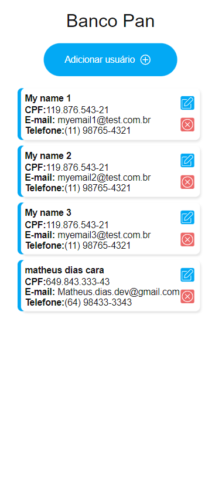

<p align="center">
  
</p>

<br>

## Inicializar Projeto Através do NPM


Nosso primeiro passo é clonar o projeto e entrar na pasta do projeto;

```bash
$ git clone https://github.com/Matheuscara/frontend-bancopan
$ cd frontend-bancopan-matheusdias
```

O proximo passo é iniciar o projeto;

```bash
npm install
npm start
```

## Vamos Testar nossa aplicação com o Jest

Para inicializar os testes:

```bash
npm run test
```

## Tecnologias: 

O desenvolvimento se consiste em tais bibliotecas:

- [React](https://reactjs.org)
- [TypeScript](https://www.typescriptlang.org/)
- [Redux toolkit](https://redux-toolkit.js.org/)
- [Redux](https://redux.js.org/)
- [react-router-dom](https://www.npmjs.com/package/react-router-dom)
- [jest](https://jestjs.io/pt-BR/)

## Justificativa de Arquitetura e Bibliotecas:

A minha intenção foi desenvolver uma solução que pudesse ser escalável, criando componentes e formas de produzir uma codificação mais simples para o futuro, contudo, gerou uma complexidade no código inicial.

---
- typescript:
  - Tipagem de contextos, gerando menos problemas para o futuro.
---
- Redux, Redux Toolkit:
  - Contexto de variáveis em todos os componentes, independente da árvore de props.
---
- react-router-dom:
  - Roteamento mais facilitado e possibilidade de contexto por url.
---
- jest:
  - Testes unitários.
---

## Minhas Dificuldades:

As minhas dificuldades foram:

Estava muito tempo sem desenvolver com Ts, isso me atrasou, mas ficou simples depois de um tempo.

Os teste com jest com React, estavam me deixando meio confuso, com certeza prefiro xUnit de c#, preciso melhorar nesse ponto.